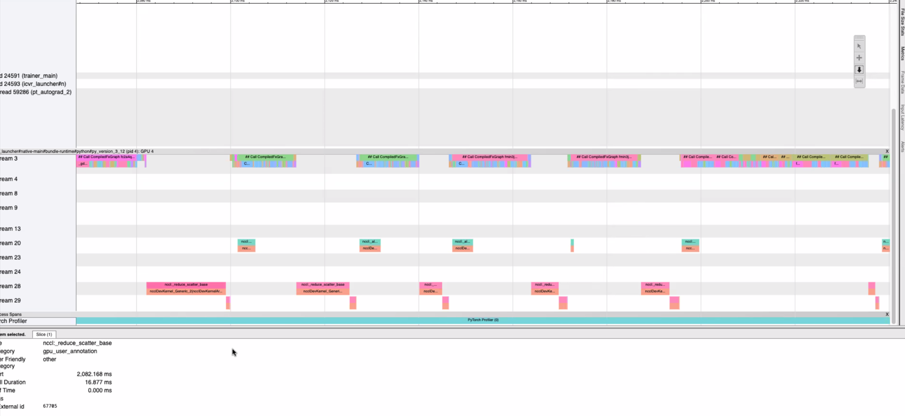

# AORTA Compute-Communication Overlap Toolkit

This repository provides a production-ready benchmarking harness to debug compute-communication overlap issues in PyTorch FSDP2 workloads. It targets both NVIDIA CUDA and AMD ROCm 7 environments and delivers:

- A synthetic large-scale ranking/recommendation workload with a transformer backbone (`train.py`).
- Explicit multi-stream execution (compute, all-reduce, reduce-scatter, auxiliary/prefetch) with torch.cuda Events for microsecond timing.
- Instrumented FSDP2 training loop that intercepts distributed collectives to bind them to dedicated streams.
- Profiling artefacts (JSONL) capturing detailed overlap metrics per iteration.
- ROCm-specific diagnostics via `rocm-smi` (optional) and cross-platform launch scripts.
- Reporting utilities (`analysis/overlap_report.py`) to visualise overlap efficiency and compare AMD vs NVIDIA runs.

Implementation patterns throughout the repository take inspiration from publicly available examples in TorchRec and TorchTitan, which served as reference points while assembling this toolkit.

**Why This Workload Helps**
- Synthetic ranking features eliminate input variability, making any overlap shifts traceable to scheduling or communication changes instead of dataloader jitter.
- The transformer encoder stack stresses both dense matmuls and collective-heavy layers, mirroring real recommendation models while remaining configurable.
- Four-way stream orchestration (compute, all-reduce, reduce-scatter, auxiliary) reproduces production pipeline structure so captured traces expose true inter-stream contention.
- FSDP2 parameter sharding amplifies communication volume, increasing the signal-to-noise ratio when measuring compute-comm overlap improvements or regressions.
- Tunable hyperparameters in `config/default.yaml` let you scale model width, depth, or batch size to probe specific bottlenecks without touching application code.

## Motivation:
* Reports of sub-optimal overlap of comms and compute in their prod training workload

  

## Repository Layout

- `config/default.yaml` – Baseline configuration for model, dataset, FSDP, and training hyperparameters.
- `src/aorta/` – Python package containing models, data generation, utilities, profilers, and training loop.
- `src/aorta/training/ddp_overlap.py` – DDP communication hook binding all-reduce and reduce-scatter to dedicated streams so compiled GEMMs can overlap with collectives.
- `train.py` – CLI entry point used by launch scripts; wraps `aorta.training.fsdp_trainer`.
- `scripts/launch_cuda.sh` / `scripts/launch_rocm.sh` – Convenience launchers for CUDA and ROCm nodes respectively.
- `analysis/overlap_report.py` – Post-processing utility to generate summary statistics and plots from profiling logs.

## Key Assumptions

- PyTorch ≥ 2.2 with FSDP2 APIs is available on both CUDA (NCCL) and ROCm 7 (RCCL) systems.
- TorchTitan components required by your wider stack are pre-installed (the synthetic workload does not import TorchTitan directly).
- PyYAML, matplotlib, and ROCm tooling (`rocm-smi`, `rocminfo`) are present on the target machine; the code gracefully degrades when they are absent.
- GPU nodes expose NCCL/RCCL capable interconnects and allow `torchrun --standalone` launch mode.
- PyTorch ≥ 2.2 with `torch.compile` support is recommended if you intend to enable ahead-of-time compilation.
- Sufficient GPU memory exists to host the configured model (see `config/default.yaml`). Adjust dimensions downward if required.
- The synthetic dataset is intended for profiling and does not reflect production data distributions.
- All processes run under a job launcher that sets `LOCAL_RANK` (e.g., `torchrun`, Slurm, or similar). Launch scripts handle this automatically.


## Docker Setup
* Pull Docker image and setup
  This image contains all the necessary deps to train PyTorch models of varying complexity.
  It contains the downloaded copy of the criteo dataset (not included in the steps below)
  More importantly, it contains the bells and whistles to run and capture profiler traces for the training runs
```bash
cd docker
docker compose up -d
```
* Connect to the running container via CLI or vscode

* Running torchrec benchmark training pipeline

```bash
python -m torchrec.distributed.benchmark.benchmark_train_pipeline --yaml_config=$ROOT/config/torchrec_dist/sparse_data_dist_base.yaml    --name="sparse_data_dist_q_contend$(git rev-parse --short HEAD || echo $USER)"
```
This captures a profiler trace file locally


## Setup

1. Ensure Python ≥ 3.10 with PyTorch and distributed support is installed on the node(s).
2. Install Python dependencies (if missing):
   ```bash
   pip install pyyaml matplotlib
   ```
3. On ROCm systems, verify `rocm-smi` and `rocminfo` are in `$PATH`.
4. Run entrypoints (`train.py`, `analysis/overlap_report.py`) from the repository root so their bundled path bootstrapper can locate the `src/` package.

## Tuning Sweep

## Running the Benchmark

### CUDA

```bash
bash scripts/launch_cuda.sh config/default.yaml
```

### ROCm 7

```bash
bash scripts/launch_rocm.sh config/default.yaml
```

Both scripts default to `config/default.yaml` but accept an override as the first argument. They query `torch.cuda.device_count()` to size `--nproc_per_node`, fall back gracefully when detection fails, and export `PYTHONPATH=$REPO_ROOT/src` so the in-repo `aorta` package is discoverable without installation.

### Direct Invocation

```bash
torchrun --nproc_per_node 4 train.py --config config/default.yaml --override training.max_steps=100
```

Use dotted `--override` arguments to mutate configuration values without editing the YAML file.

## Torch Compile Acceleration

- Enable AOT compilation by toggling the `compile` block or CLI overrides:
  ```bash
  torchrun --nproc_per_node 4 train.py \
    --config config/default.yaml \
    --override compile.enabled=true compile.backend=inductor compile.mode=max-autotune
  ```
- The toolkit compiles the FSDP-wrapped model and falls back gracefully if `torch.compile` raises (logging the reason).
- On ROCm, `torch.compile` with `backend=inductor` is still experimental; the launcher automatically downgrades to the safer `aot_eager` backend when necessary. You can override this by explicitly passing another backend (e.g., `compile.backend=aot_eager`).
- Tune `compile.fullgraph`, `compile.dynamic`, or `compile.options` (passed directly to `torch.compile`) to match your workload characteristics.
- Compilation occurs per rank, so expect extra time on the first iteration; subsequent steps reuse the optimized graph.

## SDMA Prototype Benchmark

- To measure theoretical compute/SDMA overlap on ROCm without modifying the full training loop, run the standalone benchmark:
  ```bash
  python scripts/run_sdma_prototype.py --device 0 --matrix-size 4096 --copy-mb 64
  ```
- The script launches GEMM-heavy kernels on one stream while issuing `hipMemcpyAsync` transfers on a high-priority stream, reporting the average duration with and without overlap plus the estimated savings.
- Use `rocprofv3` (or `scripts/rocprof_capture.sh`) against this benchmark to inspect SDMA engine utilization and validate whether transfers run concurrently with compute on your hardware/driver stack.

## Tuning for Overlap

All knobs below can be adjusted via `config/default.yaml` or dotted `--override` arguments when invoking `train.py` or the launch scripts.

| Category | Knob | Expected behaviour |
| --- | --- | --- |
| **FSDP scheduling** | `fsdp.forward_prefetch` | `true` prefetches parameters ahead of the forward pass, increasing chances of overlapping all-gathers with compute; `false` fetches on demand and may serialize. |
| | `fsdp.limit_all_gathers` | Limits outstanding all-gathers. Disabling expands concurrency (at the cost of memory). |
| | `fsdp.backward_prefetch` | `BACKWARD_PRE` launches next-layer communication during backprop; `BACKWARD_POST` waits until after gradients are computed. |
| | `fsdp.sync_module_states` / `fsdp.use_orig_params` | Control how parameters are synchronised; flipping them primarily affects startup comm volume. |
| **Workload intensity** | `training.batch_size`, `training.gradient_accumulation` | Scale compute duration per step. Larger batches increase GEMM time, potentially widening overlap windows once comm is in-flight. |
| | `training.mixed_precision` (`bf16`/`fp16`/`none`) | Alters kernel type/footprint. Changing precision shifts VGPR/LDS usage, influencing scheduler fairness. |
| | `training.max_steps`, `training.log_interval` | Control run length and logging frequency for targeted profiling (e.g., warm-up vs. steady state). |
| **Distributed env** | `RCCL_*` environment variables (`RCCL_NUM_CHANNELS`, `RCCL_ENABLE_SDMA`, `RCCL_BUFFER_SIZE`, etc.) | Steer RCCL algorithm, channel count, and SDMA usage. Set via launch scripts so experiments are reproducible. |
| | `distributed.enable_overlap` | Enables the DDP overlap manager which issues gradient all-reduce/reduce-scatter on dedicated streams so GEMMs from compiled graphs can overlap with communication. |
| | `distributed.overlap_reduce_scatter` / `distributed.overlap_clone_for_reduce_scatter` | Toggle telemetry reduce-scatter launches and the use of gradient clones to avoid aliasing when layering comm stress on top of DDP. |
| | `training.output_dir` | Point to unique directories to keep profiler JSONL and artefacts isolated for each run. |
| **Profiler** | `profiling.enabled`, `wait/warmup/active/repeat` | Adjust capture cadence. Smaller windows capture more frequently; larger windows reduce overhead and focus on steady state. |
| | `profiling.tensorboard`, `profiling.chrome_trace` | Select output format. Chrome traces are disabled automatically on ROCm; enable only on CUDA systems. |
| **SDMA experiments** | `scripts/run_sdma_prototype.py` (`--matrix-size`, `--copy-mb`, `--iterations`) | Isolate GEMM + SDMA overlap to benchmark hardware capability; use as baseline for comparison with full workloads. |

### Additional scenarios to explore
- **Kernel chunking / occupancy capping**: split large GEMMs or reduce active waves so the hardware scheduler has chances to issue communication kernels between compute launches.
- **Async launch + wait pattern**: enqueue SDMA copies immediately after compute and inject a lightweight wait kernel just before the data is consumed (mirrors the approach described in the internal transcript).
- **Stream isolation and priorities**: ensure collectives execute on dedicated HIP streams created with `torch.cuda.Stream(priority=…)`; prevents default-stream enqueueing and allows experimentation with priority hints.
## Profiling Outputs

Each rank writes `artifacts/rank_<rank>_metrics.jsonl` containing iteration-level telemetry:

- Per-stream durations (ms) for compute, all-reduce, reduce-scatter, and auxiliary streams.
- Overlap segments with concurrency statistics and utilisation ratios.
- ROCm diagnostic output when enabled (rank-local).
- Loss, learning rate, gradient norms, and global step counters.

Events are captured using `torch.cuda.Event(enable_timing=True)` for microsecond fidelity. Distributed collectives are monkey-patched at runtime so that all-reduce and reduce-scatter operations execute on dedicated streams and contribute to overlap calculation.

## Generating Reports

Run the analyser to build summaries and plots from one or more log directories:

```bash
python analysis/overlap_report.py \
  --log-dir artifacts_rocm --label rocm \
  --log-dir artifacts_cuda --label cuda \
  --output reports/2024-roc-vs-cuda \
  --reference cuda --candidate rocm
```

This command emits:

- `summary.json` with aggregate metrics per dataset plus comparative ratios.
- `{label}_timeline.png` overlays showing compute and overlap durations per global step.

Use these artefacts to pinpoint scheduling or synchronisation regressions between hardware backends.

## Diagnostic Insights

- **Overlap Ratio** (`overlap_ratio`) close to 1 indicates strong overlap; values near 0 imply communications block compute.
- Compare `compute_allreduce_ms` vs `compute_reducescatter_ms` to determine which collective dominates stall time.
- Inspect `active_segments` in the JSONL logs to align iteration windows with external profilers (e.g., ROCm tracer).
- Cross-reference `rocm_smi_output` against overlap dips to correlate DVFS throttling or memory pressure with scheduling gaps.

## Extending the Toolkit

- Adjust model depth/width in `config/default.yaml` to stress-test memory and communication pressure.
- Swap `MixedPrecision` modes via `training.mixed_precision` (`none`, `fp16`, or `bf16`).
- Leverage the JSONL logs to integrate with external profilers or dashboards (e.g., Prometheus, Weights & Biases).
- Implement custom communication hooks by editing `StreamProfiler.intercept_distributed_ops`.

## Troubleshooting

- **ImportError: No module named 'yaml'** – Install PyYAML or supply a JSON config instead.
- **rocm-smi not found** – Install ROCm utilities or omit `--enable-rocm-metrics`.
- **CUDA driver errors** – Verify `CUDA_DEVICE_MAX_CONNECTIONS=1` (set in launcher) to encourage overlap-friendly scheduling.
- **Slow dataloading** – Increase `dataloader.num_workers` or reduce dataset volume.
- **Invalid device ordinal** – Ensure launchers' `NPROC` does not exceed available GPUs; the toolkit remaps surplus local ranks modulo the visible devices, but persistent failures usually indicate mismatched visibility (`CUDA_VISIBLE_DEVICES`/`HIP_VISIBLE_DEVICES`).

## Torch Profiler Traces

- Enable PyTorch's profiler by toggling the `profiling` block in your config or via CLI override:
  ```bash
  torchrun --nproc_per_node 4 train.py \
    --config config/default.yaml \
    --override profiling.enabled=true \
    --override profiling.wait=1 \
    --override profiling.warmup=1 \
    --override profiling.active=2
  ```
- TensorBoard traces write to `artifacts/torch_profiler/rank*/` by default; launch `tensorboard --logdir artifacts/torch_profiler` and use the Profile tab for stream timelines.
- Chrome traces can be enabled via `profiling.chrome_trace=true` (not recommended on ROCm; the toolkit disables them automatically to avoid known Kineto crashes). Adjust `wait`, `warmup`, `active`, and `repeat` to control capture cadence; shapes and memory statistics are recorded by default.

## ROCm `rocprofv3` Capture

- Use the wrapper script to profile an entire ROCm run:
  ```bash
  bash scripts/rocprof_capture.sh config/default.yaml --override training.max_steps=50
  ```
- Outputs land under `rocprof_traces/run_<timestamp>/`. Override location or extra flags with environment variables:
  - `ROCPROF_OUTPUT_DIR=/path/to/out`
  - `ROCPROF_ARGS="--att --kernel-trace --kernel-symbols"`
- The script mirrors `launch_rocm.sh` but executes through `rocprofv3`, so you can merge traces with the JSONL metrics using the shared iteration timestamps.

For deeper inspection, combine these scripts with `nsys`, `rocprof`, or PyTorch profiler traces using the iteration timestamps documented in the JSON traces.
