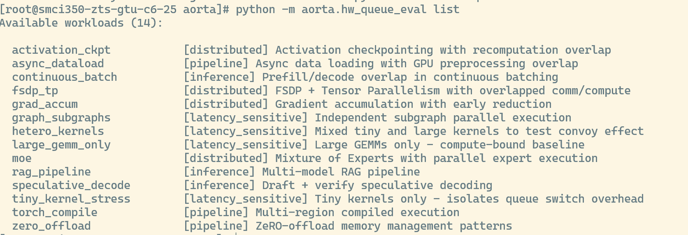
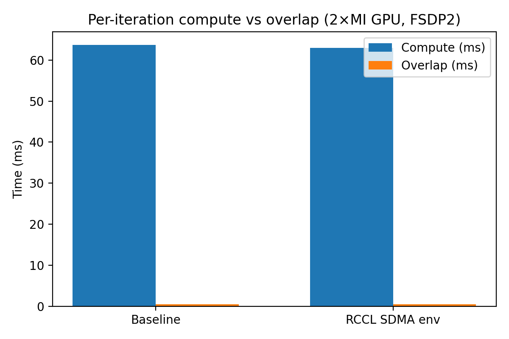

# AORTA

GPU performance benchmarking and debugging toolkit for PyTorch workloads on AMD ROCm.


## What It Does

**FSDP2 Compute-Communication Overlap Analysis**
Debug why distributed training isn't overlapping compute with communication. Runs a synthetic transformer workload with explicit multi-stream execution, captures per-iteration timing, and generates overlap efficiency reports.


**Hardware Queue Evaluation**
Stress-test GPU queue scheduling with 8-64+ concurrent streams. Includes 15 workloads covering distributed training patterns (FSDP, MoE, activation checkpointing), inference (speculative decoding, continuous batching), and latency-sensitive scenarios (heterogeneous kernels, tiny kernel dispatch).




## Quick Start

```bash
# FSDP2 overlap benchmark
bash scripts/launch_rocm.sh config/default.yaml

# Hardware queue evaluation
python -m aorta.hw_queue_eval list                          # List workloads
python -m aorta.hw_queue_eval run hetero_kernels --streams 8
python -m aorta.hw_queue_eval sweep hetero_kernels --streams 1,2,4,8,16
```

## Example Analysis

AORTA generates comprehensive performance reports comparing ROCm versions across multiple configurations. See a [full example report](docs/comprehensive_report.html) comparing rocm-7.0.8-meta vs rocm-7.0.10-meta:

- **8 configurations tested**: 256/512 threads × 28/42/56/70 RCCL channels
- **96 visualizations**: Overlap ratios, GEMM throughput, NCCL metrics, timeline comparisons
- **Side-by-side diffs**: Identify regressions or improvements between driver/library versions



## Documentation

| Guide | Description |
| --- | --- |
| [Getting Started](docs/getting-started.md) | Prerequisites, Docker setup, installation |
| [Running the Benchmark](docs/running-benchmark.md) | Launch scripts, torch.compile, direct invocation |
| [Hardware Queue Eval](docs/hw-queue-eval.md) | Workloads, CLI usage, metrics |
| [Configuration](docs/configuration.md) | FSDP tuning, RCCL variables, profiler settings |
| [Profiling](docs/profiling.md) | Torch profiler, rocprofv3, overlap reports |
| [Troubleshooting](docs/troubleshooting.md) | Common issues |

## Repository Layout

```
src/aorta/
├── training/          # FSDP2 trainer with multi-stream overlap instrumentation
├── hw_queue_eval/     # Hardware queue evaluation framework
├── models/            # Synthetic ranking transformer
├── profiling/         # Stream profiler for overlap measurement
└── utils/             # Config loading, timing, device detection

config/                # YAML configurations for different scenarios
scripts/               # Launch scripts, profiling, analysis tools
analysis/              # Overlap report generation
```

## Development

```bash
pip install -r requirements-dev.txt
pre-commit install
pytest tests/
```

---

*The FSDP2 overlap workloads also run on NVIDIA CUDA for side-by-side comparison with ROCm.*
