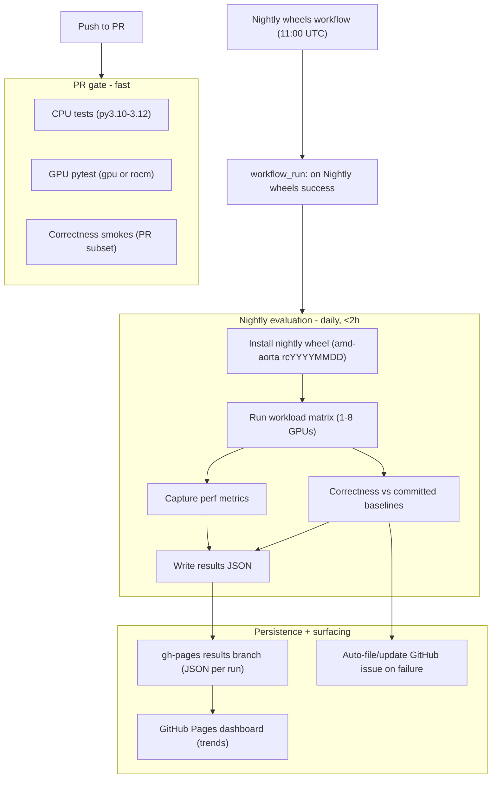

# Aorta CI/CD plan (proposed)

Status: **proposed** (for review). This document is the source of truth for the
next iteration of aorta CI. It builds on the Phase 1 CPU gate and Phase 2 GPU
gate already in place (see [`ci-testing-plan.md`](ci-testing-plan.md)) and makes
the CI broader, trend-aware, and useful for future users.

A parallel plan for `aorta-internal` will follow once this is finalized.

## Goals

1. **PR gate** — catch regressions fast on every push, without starving the
   single self-hosted GPU box.
2. **Nightly evaluation** — install the **released nightly wheel** and evaluate
   the workloads' **correctness** (against committed baselines) and capture
   their **performance** as trend data, for that specific build.
3. **Visualization** — a dashboard showing, per nightly build, the status of
   tests / workloads / recipes and how performance trends over time.
4. **Broad, relevant coverage** — all workloads with per-workload matrices,
   easy to extend as new workloads land.

## Architecture

## 1. PR gate (fast — largely as today)

- **CPU tests** on all PRs (py3.10 / 3.11 / 3.12).
- **GPU pytest** (`pytest -m "gpu or rocm"`) + a **small correctness smoke
  subset** (`gpu_smoke`, `inference` offline) on GPU-touching paths.
- **No** baseline evaluation, perf capture, or full matrix on PRs — those are
  nightly. This keeps PR latency low and protects the single runner.

## 2. Nightly evaluation

- **Trigger:** `workflow_run` on successful completion of the existing
  `Nightly wheels` workflow (which publishes at 11:00 UTC), plus
  `workflow_dispatch`. This chains the eval to the artifact it validates.
- **Target under test:** the **released nightly wheel**
  `amd-aorta==X.Y.ZrcYYYYMMDD`, installed from the rolling `dev-wheels`
  prerelease. The repo is checked out only for recipes / manifest / baselines /
  the runner scripts. So CI validates exactly what users `pip install`.
- **Execution:** run the workload matrix (Section 6), harvesting each run's
  `matrix.json` / trial JSON. Produce, per (workload x config): a correctness
  verdict (vs baseline), perf metrics, and duration.
- **Cadence / budget:** daily, kept under ~2h wall-clock on the 8-GPU box.
  Matrix axis sizes are chosen to fit; trimming is a manifest change.

## 3. Correctness via expected-outcome baselines

- New committed file `config/ci/regression_baselines.yaml` (public analog of
  aorta-internal's `regression_gates.yaml`): per workload x config, the expected
  outcome — `passed`, metric tolerances (e.g. step-time range, throughput
  floor), `nan_rate` bounds, and checksums where a workload emits them.
- A comparator turns "the workload ran" into pass/fail **against the baseline**,
  catching silent correctness drift that `--strict` alone cannot (it only
  catches errored / did-not-run cells).
- **Baseline lifecycle:** a dispatchable `refresh-baselines.yml` runs the
  matrix, captures observed metrics as candidate baselines, and **opens a PR**
  updating `regression_baselines.yaml` for a human to review and bless. No
  auto-committing of baselines.

## 4. Performance (trend capture; no gate yet)

- Capture per-workload metrics every nightly (step time, throughput, latency,
  nan rate — whatever the workload emits).
- Persist as trend data and chart it on the dashboard. **No perf failure gate
  initially** — regressions are surfaced visually and via alerting, not
  blocking. Perf thresholds can be added later (Phase 4) once trends stabilize.

## 5. Results persistence + dashboard

- **Store:** a `gh-pages` (or dedicated `ci-results`) branch holding
  `results/<YYYY-MM-DD>.json` per nightly. Each file records the build version
  and, per entry: correctness status, metrics, deltas vs baseline, duration,
  and artifact links.
- **Dashboard (GitHub Pages):** a static site generated from the JSON history:
  - Latest build: overall status badge + the rc version tested.
  - Table: workload x config -> correctness (green/red) + a per-metric sparkline.
  - Trend charts: each metric over builds; test-suite pass-rate over time.
  - Coverage view: which recipes/workloads are covered and their last status.
  - Requires GitHub Pages enabled for the repo (enable in Settings if not).
    Fallback if Pages is unavailable: publish the generated HTML as a run
    artifact.

## 6. Coverage matrix (nightly; sized to ~2h on 8 GPUs)

| Workload | Matrix axes |
| --- | --- |
| `gpu_smoke` | dtype: fp32 / fp16 / bf16 (1 GPU) |
| `inference` | mode: offline / continuous; dtype (1 GPU) |
| `training` | ddp + fsdp; nproc: 2, 8; dtype |
| `race` | fsdp; nproc: 2, 8 |
| `llm_determinism` | nproc: 2, 8 |
| `hrx` / `hrx_perf` | launch-probe; gemm + triad |
| pytest `gpu` / `rocm` | full selection |

- Manifest-driven ([`config/ci/gpu_regression_smokes.yaml`](../config/ci/gpu_regression_smokes.yaml));
  extend by adding rows. If the matrix exceeds the time budget, trim axis sizes.
- Intentionally excluded: `recipes/race/ainic-*` (AINIC fabric-specific),
  `recipes/probe/*` (templates), `recipes/emulated/*` (mirage emulator).

## 7. Alerting

- On any nightly correctness failure (baseline mismatch or errored workload),
  **auto-file/update a GitHub issue** ("Nightly regression <date>") listing the
  failing entries with artifact links; comment/close when green. The dashboard
  reflects the same status.

## 8. Automated ROCm + dependency bumps

The pinned stack is kept current **automatically**, so we never manually chase
versions and every bump is a tested, reviewable change. "The pinned stack" means
everything CI's reproducibility depends on:

- the ROCm base image (by digest), PyTorch/ROCm, and hipBLASLt;
- **the Python requirements — `requirements.txt` and `requirements-dev.txt` are
  kept as exact version pins** (a reproducible, fully-pinned set), not floating
  ranges, so a CI run is byte-reproducible and a dependency change is an explicit,
  reviewed diff.

- **Watcher workflow (scheduled):** detects newer versions of the ROCm base
  image digest, torch (ROCm index), hipBLASLt, **and the pinned
  `requirements*.txt` packages**, and **opens a bump PR** updating the pinned
  values (`docker/Dockerfile.*`, `.env.ci` / index URL, `requirements.txt`,
  `requirements-dev.txt`).
- **CI validates the bump PR:** runs the GPU gate + the matrix evaluation on the
  *new* stack, so correctness and performance impact are visible before merge.
- **Baselines refresh in the same PR:** a ROCm / hipBLASLt change legitimately
  moves numerics and step times, so the bump PR also regenerates candidate
  baselines. The **baseline diff is the impact of the bump** -- exactly what the
  reviewer inspects. (Automated bump and baseline re-bless are the same flow,
  because a ROCm change and a numerics change are indistinguishable otherwise.)
- **Human approves; no blind auto-merge.** The bot proposes, a reviewer blesses.
  (A future refinement may auto-merge only when every entry stays within
  tolerance.)
- **ROCm as recorded metadata:** every nightly result records the ROCm / torch /
  hipBLASLt versions it ran against; the dashboard annotates trend charts at
  bump points so a shift can be attributed to the bump vs an aorta change.
- **Optional candidate-ROCm axis (slower cadence):** to catch problems in an
  upcoming ROCm before adopting it, the full matrix can run against a candidate
  ROCm weekly (kept off the daily path for the ~2h/single-runner budget).

## Phased rollout

| Phase | Deliverable |
| --- | --- |
| 1 | Nightly harness: install the wheel + run the matrix + correctness baselines (bless the initial set) + write results JSON |
| 2 | `gh-pages` results branch + GitHub Pages dashboard (correctness + perf trends) |
| 3 | Auto-issue alerting; broaden matrices to the full target |
| 4 | Automated ROCm/dependency bump workflow (bump PR + baseline refresh + validation) |
| 5 | (later) optional perf gates; optional auto-merge of in-tolerance bumps |

The PR gate stays as-is (minor tidy only) throughout.

## Open items

- Confirm GitHub Pages is enabled for `ROCm/aorta` (or enable it); otherwise use
  the artifact-hosted HTML fallback.
- Decide the exact metric set + tolerances per workload when blessing the first
  baselines.
- Confirm the ~2h nightly budget holds once real matrix timings are measured;
  trim axes if needed.
- Convert `requirements.txt` / `requirements-dev.txt` to exact version pins as
  the baseline state the automated bump flow maintains (decide whether to keep
  loose ranges in packaging metadata while CI installs from a pinned lock).
