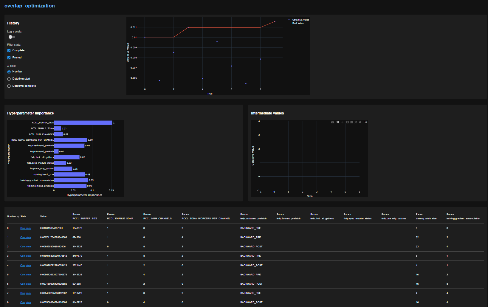

# Configuration Guide

All configuration knobs can be adjusted via `config/default.yaml` or dotted `--override` arguments when invoking `train.py` or the launch scripts.

## Configuration Reference

| Category | Knob | Expected Behaviour |
| --- | --- | --- |
| **FSDP scheduling** | `fsdp.forward_prefetch` | `true` prefetches parameters ahead of the forward pass, increasing chances of overlapping all-gathers with compute; `false` fetches on demand and may serialize. |
| | `fsdp.limit_all_gathers` | Limits outstanding all-gathers. Disabling expands concurrency (at the cost of memory). |
| | `fsdp.backward_prefetch` | `BACKWARD_PRE` launches next-layer communication during backprop; `BACKWARD_POST` waits until after gradients are computed. |
| | `fsdp.sync_module_states` / `fsdp.use_orig_params` | Control how parameters are synchronised; flipping them primarily affects startup comm volume. |
| **Workload intensity** | `training.batch_size`, `training.gradient_accumulation` | Scale compute duration per step. Larger batches increase GEMM time, potentially widening overlap windows once comm is in-flight. |
| | `training.mixed_precision` (`bf16`/`fp16`/`none`) | Alters kernel type/footprint. Changing precision shifts VGPR/LDS usage, influencing scheduler fairness. |
| | `training.max_steps`, `training.log_interval` | Control run length and logging frequency for targeted profiling (e.g., warm-up vs. steady state). |
| **Distributed env** | `RCCL_*` environment variables | Steer RCCL algorithm, channel count, and SDMA usage. Set via launch scripts so experiments are reproducible. |
| | `training.output_dir` | Point to unique directories to keep profiler JSONL and artefacts isolated for each run. |
| **Profiler** | `profiling.enabled`, `wait/warmup/active/repeat` | Adjust capture cadence. Smaller windows capture more frequently; larger windows reduce overhead and focus on steady state. |
| | `profiling.tensorboard`, `profiling.chrome_trace` | Select output format. Chrome traces are disabled automatically on ROCm; enable only on CUDA systems. |
| **SDMA experiments** | `scripts/run_sdma_prototype.py` args | `--matrix-size`, `--copy-mb`, `--iterations` - Isolate GEMM + SDMA overlap to benchmark hardware capability. |

## RCCL Environment Variables

Common RCCL variables to experiment with:

- `RCCL_NUM_CHANNELS` - Number of channels for collective operations
- `RCCL_ENABLE_SDMA` - Enable/disable SDMA engine usage
- `RCCL_BUFFER_SIZE` - Buffer size for collective operations

Set these via launch scripts to ensure reproducibility.

## Tuning Scenarios

### Kernel Chunking / Occupancy Capping

Split large GEMMs or reduce active waves so the hardware scheduler has chances to issue communication kernels between compute launches.

### Async Launch + Wait Pattern

Enqueue SDMA copies immediately after compute and inject a lightweight wait kernel just before the data is consumed.

### Stream Isolation and Priorities

Ensure collectives execute on dedicated HIP streams created with `torch.cuda.Stream(priority=...)`. This prevents default-stream enqueueing and allows experimentation with priority hints.

## Parameter Sweep

## Next Steps

- [Running the Benchmark](running-benchmark.md) - Launch training with your configuration
- [Profiling Guide](profiling.md) - Capture and analyze performance data
