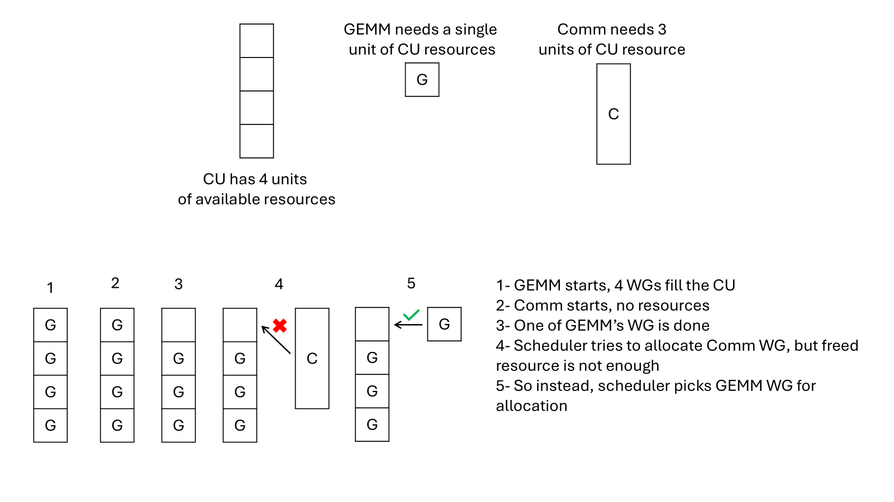
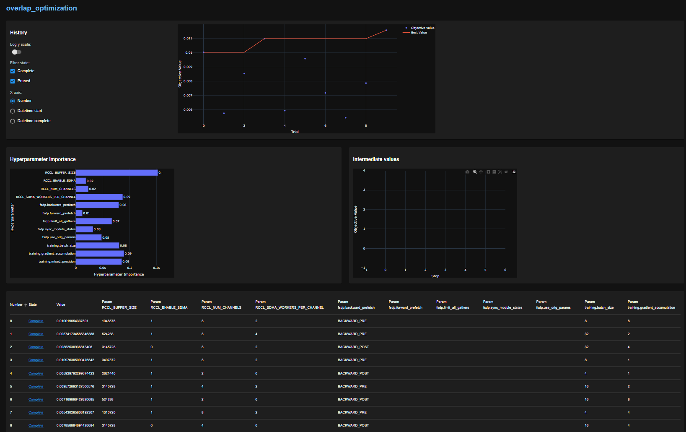

# Configuration Guide

All configuration knobs can be adjusted via `config/default.yaml` or dotted `--override` arguments when invoking `train.py` or the launch scripts.

## Trial environment variables

AORTA uses one controlled environment-variable overlay for host workloads and
workload-owned isolation backends. Its precedence, from lowest to highest, is:

```text
Environment.env
< named mitigations
< recipe-level extra_env
< cell-level extra_env or direct aorta run --extra-env
```

| Surface | Purpose |
| --- | --- |
| `Environment.env` | Baseline variables intrinsic to a registered or inline environment. |
| Mitigations | Named runtime or diagnostic variable bundles. |
| Recipe `extra_env` | Variables applied to every cell in a matrix recipe. |
| Cell `extra_env` | Per-cell overrides; wins over recipe-level values. |
| `workload_config` | Workload-specific configuration, not environment variables. It is passed to the workload constructor and does not enter the environment overlay. |

All environment mappings are `dict[str, str]`; numeric and boolean YAML/JSON
values are rejected rather than coerced. For host workloads, the dispatcher
applies the effective overlay before environment capture and workload
`setup()`/`run()`, then restores the process environment after each trial.
Unrelated variables inherited through `os.environ` are never added to the
controlled overlay.

### Trial process isolation

The top-level recipe field `trial_isolation` accepts `auto`, `in_process`, or
`process`. `auto` follows workload metadata. `process` launches a fresh Python
worker for every trial and places the resolved controlled overlay in its
environment before Python imports workloads or native libraries.

Workloads default to `in_process`; workloads with process-static correctness
requirements can require `process`. Recipes may request stronger isolation but
cannot disable a workload requirement. `race` requires process isolation so
per-cell HIP/RCCL settings are effective from interpreter startup. Probe mode
keeps its existing subprocess protocol and rejects this field.

Process support is opt-in for plugins because the isolated worker owns the
default distributed process group. A process-capable plugin declares matching
class metadata and side-effect-free package metadata:

```toml
[project.entry-points."aorta.workload_policies"]
my_workload = "aorta.run.validation:PROCESS_OPTIONAL_POLICY"

[project.entry-points."aorta.workload_startup_env"]
my_workload = "my_package.startup:startup_env"
```

Use `PROCESS_REQUIRED_POLICY` when `auto` must always select a fresh worker.
The dispatcher reads this entry-point value without importing plugin code;
the loaded class still declares `trial_isolation_supported` (and, when
required, `trial_isolation_default` / `trial_isolation_required`) as a
defense-in-depth consistency check inside the worker.

When a workload has config-derived defaults that must exist before its module
or native libraries import, register a lightweight startup provider returning
`dict[str, str]`. Keep that provider module free of workload/native imports.

Fresh workers add interpreter/library startup cost. Launcher identity variables
(`RANK`, `WORLD_SIZE`, `LOCAL_RANK`, `MASTER_ADDR`, and `MASTER_PORT`) remain
owned by torchrun/srun and cannot be overridden by an isolated trial overlay.
When torchrun exposes its elastic agent store, workers namespace trials there.
Any launch without an agent store—including Slurm/srun and older/static
torchrun configurations—must reserve a job-unique 1000-port range and export
its first port as `AORTA_TRIAL_MASTER_PORT_BASE`.

For the `race` FSDP harness, the requested workload dtype still controls model,
H2D, and all-gather tensors. Its synthetic rank-coded reduce-scatter correctness
oracle uses FP32 so legal BF16 accumulation-order rounding cannot be classified
as silent corruption. Trial metrics record both the workload dtype and
`reduce_scatter_oracle_dtype`.

### Workload-owned Docker launches

The dispatcher records the effective controlled overlay in
`config["_aorta_trial_env"]`. The key is always present as a plain
`dict[str, str]`, including `{}` when no controlled source contributed. A
Docker-aware workload wrapper can forward it with the public helper:

```python
from aorta.run import docker_env_flags

trial_env = config.get("_aorta_trial_env", {})
argv = ["docker", "run", *docker_env_flags(trial_env), image, *inner_command]
```

`docker_env_flags()` emits deterministic, key-sorted `-e KEY=VALUE` tokens,
validates names and string values, and never reads `os.environ`. Treat values
as potentially sensitive and do not log `_aorta_trial_env`.

The dispatcher does not launch Docker. Workload wrappers continue to own image
selection, mounts, devices, IPC/shared-memory settings, entrypoints, and inner
commands. Top-level recipe `extra_env` is a matrix/triage feature; probe-mode
recipes retain their separate environment-passthrough contract.

## Configuration Reference

| Category | Knob | Expected Behaviour |
| --- | --- | --- |
| **FSDP scheduling** | `fsdp.forward_prefetch` | `true` prefetches parameters ahead of the forward pass, increasing chances of overlapping all-gathers with compute; `false` fetches on demand and may serialize. |
| | `fsdp.limit_all_gathers` | Limits outstanding all-gathers. Disabling expands concurrency (at the cost of memory). |
| | `fsdp.backward_prefetch` | `BACKWARD_PRE` launches next-layer communication during backprop; `BACKWARD_POST` waits until after gradients are computed. |
| | `fsdp.sync_module_states` / `fsdp.use_orig_params` | Control how parameters are synchronised; flipping them primarily affects startup comm volume. |
| **Workload intensity** | `training.batch_size`, `training.gradient_accumulation` | Scale compute duration per step. Larger batches increase GEMM time, potentially widening overlap windows once comm is in-flight. |
| | `training.mixed_precision` (`bf16`/`fp16`/`none`) | Alters kernel type/footprint. Changing precision shifts VGPR/LDS usage, influencing scheduler fairness. |
| | `training.max_steps`, `training.log_interval` | Control run length and logging frequency for targeted profiling (e.g., warm-up vs. steady state). |
| **Distributed env** | `RCCL_*` environment variables | Steer RCCL algorithm, channel count, and SDMA usage. Use `extra_env` with process-isolated trials; otherwise set them before the launcher starts Python. |
| | `training.output_dir` | Point to unique directories to keep profiler JSONL and artefacts isolated for each run. |
| **Profiler** | `profiling.enabled`, `wait/warmup/active/repeat` | Adjust capture cadence. Smaller windows capture more frequently; larger windows reduce overhead and focus on steady state. |
| | `profiling.tensorboard`, `profiling.chrome_trace` | Select output format. Chrome traces are disabled automatically on ROCm; enable only on CUDA systems. |
| **SDMA experiments** | `scripts/run_sdma_prototype.py` args | `--matrix-size`, `--copy-mb`, `--iterations` - Isolate GEMM + SDMA overlap to benchmark hardware capability. |

## RCCL Environment Variables

Common RCCL variables to experiment with:

- `RCCL_NUM_CHANNELS` - Number of channels for collective operations
- `RCCL_ENABLE_SDMA` - Enable/disable SDMA engine usage
- `RCCL_BUFFER_SIZE` - Buffer size for collective operations

Use recipe/cell `extra_env` when `trial_isolation: process` is effective.
In-process runs must set import/process-static values before launching Python.

## Tuning Scenarios



### Kernel Chunking / Occupancy Capping

Split large GEMMs or reduce active waves so the hardware scheduler has chances to issue communication kernels between compute launches.

### Async Launch + Wait Pattern

Enqueue SDMA copies immediately after compute and inject a lightweight wait kernel just before the data is consumed.

### Stream Isolation and Priorities

Ensure collectives execute on dedicated HIP streams created with `torch.cuda.Stream(priority=...)`. This prevents default-stream enqueueing and allows experimentation with priority hints.

## Parameter Sweep



## Next Steps

- [Running the Benchmark](running-benchmark.md) - Launch training with your configuration
- [Profiling Guide](profiling.md) - Capture and analyze performance data
