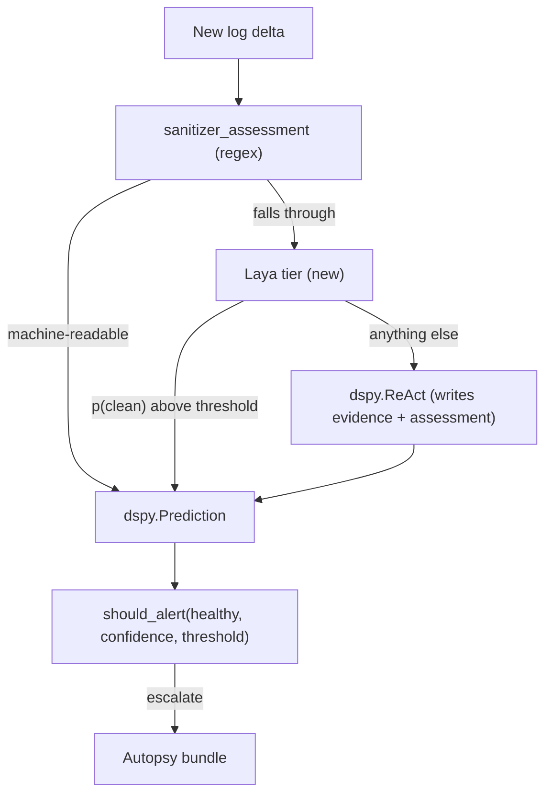
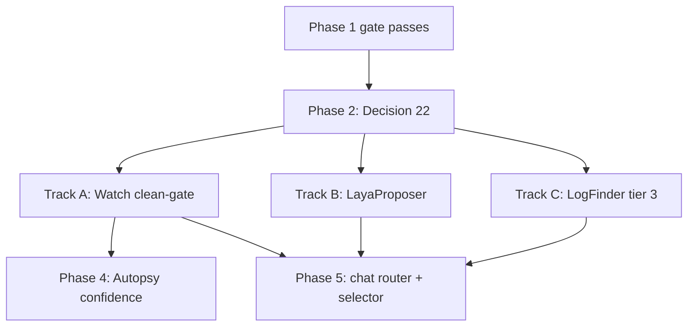

# Laya (System-1) calibrated decisions for AORTA

> Replace the LLM calls that exist only to *classify* with a typed, calibrated
> encoder. Keep every call that writes prose on the LLM.

Six decisions in this codebase share one shape: an LLM emits prose, the prose is
string-parsed into a verdict, and a self-reported `confidence` float is compared
against a hand-picked threshold. That float is not a probability. Nothing trained
it to be one; it is whatever number the model wrote next to a word, and the
thresholds around it were fitted by hand against it. Laya returns typed answers
(`noul`, `choice`) with probabilities trained against strictly proper scoring
rules in one forward pass, and never generates text at all.

Two constraints frame everything that follows.

**Latency is a CPU number, not the card's headline.** The ~33 ms in the model
card is a T4 GPU figure for the multilingual checkpoint; the English root
checkpoint answers one question in 39.5 ms on the same T4. On CPU, which is
where this will actually run, `Router(preload=True)` costs **193–464 ms**. That
is still two orders of magnitude cheaper than a remote round-trip, but it is not
free, and it rules Laya out of any path that needs a large batch per
user-visible turn unless the batch is measured first. Every target below is one
or a handful of forward passes, never thirty.

**The recurring seam is a fallback somebody already wrote.** Every strong
candidate is a place where the author had already added a non-LLM path:
`sanitizer_assessment()` in Watch, `FakeLLMProposer` for the probe agent,
`_scan_by_extension()` in the log finder. Those exist because the author already
knew the LLM call was overkill for the common case. Laya is the tier that
extends the cheap path to the uncommon case, and the fallback is the integration
point — which is why the cheapest track here needs no call-site change at all.

---

## 0. Findings that may revise the request

Read before implementing. Each is a gap between "integrate a small classifier"
and what this repository will actually accept.

### F1 — Decision 19a is enforced in CI, and the boundary test reaches further than the CI gate does

[`.github/workflows/nightly.yml`](../../.github/workflows/nightly.yml) and
[`.github/workflows/release.yml`](../../.github/workflows/release.yml) both
install `.[chat-cli]` and then hard-fail the job:

```
if python -m pip list --format=freeze | grep -Ei '^(torch|nvidia-|chromadb|sentence-transformers)'; then
  echo "::error::The chat-cli extra resolved a torch/CUDA/chromadb dependency. See Decision 19a."
  exit 1
fi
```

That gate is scoped to `[chat-cli]`. `[cia]` is installed in
[`.github/workflows/cpu-tests.yml`](../../.github/workflows/cpu-tests.yml) and
[`.github/workflows/gpu-tests.yml`](../../.github/workflows/gpu-tests.yml) with
no equivalent torch-free assertion, so the naive reading is "CIA-side work may
carry torch, chat-side work must go through ONNX."

That reading is right about the packaging and wrong about the imports.
`_HEAVY_PREFIXES` in
[`tests/cli/test_chat_boundaries.py`](../../tests/cli/test_chat_boundaries.py)
lists `torch`, `onnxruntime` and `fastembed` alongside the langchain stack, and
it gates **two** subprocess probes, not one. The second is
`test_importing_the_agent_proposer_does_not_pull_in_langchain`, which imports
`aorta.agent.llm` in a fresh interpreter and asserts the same emptiness, because
`aorta agent mitigate --llm-backend=fake` is the default and must stay fully
offline on a base install.

So Track B's `LayaProposer` lands in the one CIA-adjacent module that *is*
import-gated. A module-scope `import laya` there would turn the offline default
backend into one that pays for torch, and on a base install it would stop
working entirely. Every loader in every track is imported inside the function
that needs it.

**Resolution.** Decision 22 (Phase 2, and
[`docs/laya-packaging.md`](../laya-packaging.md)) is written before any
integration code, and it covers all three of these separately: which extra may
declare the dependency, which import graphs must stay clean of it, and which
runtime carries the weights. The Phase 0/1 tooling has since added a third probe
of the same shape, `test_importing_the_seam_pulls_in_no_model_machinery` in
[`tests/cia/test_laya_predictor.py`](../../tests/cia/test_laya_predictor.py),
covering `import aorta.laya`.

### F2 — The base checkpoints are below the majority-class baseline, so Phase 1 is a real gate

The card is explicit, and the number is not close: on its own typed-decisions
benchmark `laya` scores 0.362 against a 0.461 per-question majority class and a
0.735 teacher self-agreement ceiling. The 0.766 headline belongs to
`laya-typed-decisions`, fine-tuned on that benchmark's own training split. The
card's own summary is "a fast base to specialise, not a zero-shot decision
engine."

Nothing in that benchmark is a ROCm log or a GCN assembly listing, so the
question Phase 1 answers is not "is Laya good" but "does a fine-tune on *our*
corpus beat what we already ship." The bar for that is deliberately not the
majority class.

**Resolution.** Phases 0 and 1 exist to find out before any integration work
happens, and Phase 1 carries an explicit kill criterion. A negative result is
written up and the effort closes; that is a successful outcome for this plan,
not a failed one.

### F3 — Laya is a gate, not a replacement

Watch's `forward` returns a `dspy.Prediction` carrying `evidence` (the log lines
`write_bundle` persists) and `assessment` (the paragraph that lands in the
events file). Both are consumed downstream, and a model that never generates
text cannot produce either.

**Resolution.** Every integration below decides *whether to spend an LLM call*,
or picks among options that already exist. Where prose is consumed downstream,
the LLM still writes it. Stating this early matters because the tempting
framing — "replace the DSPy call" — would break `write_bundle` and the events
file in the same change.

### F4 — The log finder's LLM tier is a security boundary, not only a cost

Tier 3 of `LogFinder.find` in
[`src/aorta/cia/watch/log_finder.py`](../../src/aorta/cia/watch/log_finder.py)
spends a `dspy.Predict(LogDiscovery)` call on a `find` listing, and its prompt
rules are already mechanical: prefer high mtime, prefer `log`/`stderr`/`out` in
the name, skip checkpoints, skip anything under 100 bytes. `_within_job()` exists
because the model answers in free text and can therefore name a path that was
never in the listing — and that does not stop at reading the wrong file. Watch
grants the parent of every watched path as a root for its own file tools, so one
hallucinated `/etc/passwd` would have handed it `/etc`.

**Resolution.** A classifier that only ever scores candidates present in the real
listing cannot name a path that is not there. This is the one track where the
motivation is correctness rather than cost. `_within_job()` stays regardless, as
defence in depth rather than as the only barrier.

### F5 — Two obvious candidates do not fit, and saying so early saves the argument

`critic_node` looks like a fit and is not: `_CRITIC_USER_CONTEXT_LIMIT` alone is
4000 characters, and the critic needs the joined tool trace on top of that, which
will not fit 1024 tokens — let alone the English checkpoint's 512, of which
`head_max_len = 192` is reserved for the options, leaving roughly 320 tokens for
the state. Every node that writes prose is out for the reason in F3: plan, act,
answer, finalize, and Autopsy's `rationale`.

**Resolution.** Neither is in scope. `critic_node` is recorded here so the next
reader does not re-propose it.

### F6 — `[cia]` is documented as an extra that should shrink

The comment above the extra in [`pyproject.toml`](../../pyproject.toml) says so in
as many words: DSPy is what Watch and Autopsy reach a model through today, the
shared chat provider layer is where that belongs, "so this extra is expected to
shrink rather than grow." Its CI lane in `cpu-tests.yml` spans Python 3.10
through 3.14 *because the extra declares support for that same range*, and the
lane exists specifically to stop a false green.

`laya` 0.3.5 declares `torch>=2.0.0`, `transformers>=4.48.0`, `safetensors`,
`huggingface_hub` and `numpy`, and the English checkpoint is ~808 MB of weights
on top. Adding that to `[cia]` would grow the extra it was written to shrink and
would break the 3.14 leg of its own matrix the first time torch has no wheel for
a new CPython.

**Resolution.** Decision 22 puts the dependency in a separate opt-in `[laya]`
extra rather than in `[cia]`, so `pip install 'amd-aorta[cia]'` keeps its Python
range and its size. That extra has since landed, and is also kept out of `all`.
See [`docs/laya-packaging.md`](../laya-packaging.md).

---

## 1. Where Laya sits, using Watch as the worked example

The same three-tier shape applies to all three Phase 3 tracks: a deterministic
tier first, Laya second, the LLM only when Laya defers.



## 2. Phase 0 — build the labelled corpus

No Laya dependency, no repository change. Nothing downstream is measurable
without this, which is why it is first and why it is the phase most likely to be
skipped.

Join on `job_id`: the bundles written by `write_bundle(job, job_dir, evidence or
new_content[:4000], signal)` give the log delta, and
[`src/aorta/cia/triage.py`](../../src/aorta/cia/triage.py) writes the autopsy
report carrying the eventual `category`. Prefer the bundles over the events
JSONL, whose `excerpt` is capped at 500 characters — too short to train on, and a
corpus built from it would teach the classifier to decide from a truncation.

Chat-side labels need `AORTA_CHAT_SESSION_LOG=full`. Summary mode in
[`src/aorta/chat/decision_log.py`](../../src/aorta/chat/decision_log.py) stores
only `summarize_text()` digests, so it cannot supply training text. Full mode
writes questions and tool output verbatim under
`state_home()/aorta/chat/sessions/<sha256>.jsonl` — do not enable it anywhere
shared, and note that the module already warns once per session when it is on.

Target 300–500 labelled examples per decision. Laya's own typed-decisions
fine-tune used 400 cases over 2,000 decisions, so that is the scale that is known
to work rather than a guess.

Two smaller corpora for the parallel tracks, both cheaper to build than Watch's:

- **Proposer (Track B).** One example per `propose()` call: `symptom` plus
  `cell_summaries` plus `candidates` as the state, labelled by which mitigation
  actually cleared the cell and the final category the sweep reached. Sweep
  outputs already record this, so the labels cost nothing to collect.
- **Log finder (Track C).** One example per ambiguous directory: the
  `_dir_listing()` output as the state, labelled per file by whether Watch went
  on to read anything useful from it. **Label from observed usefulness, not from
  the prompt's rules.** Labelling by the rules would only teach the classifier
  the heuristic that is already sitting in tier 2, and the resulting accuracy
  number would look good while measuring nothing.

**Gate:** 300 labelled examples for at least one decision, or stop.

## 3. Phase 1 — feasibility: can the encoder read ROCm logs?

Offline, in a scratch venv, with no dependency change to this repository. Mirror
the structure of [`src/aorta/chat/rag/eval.py`](../../src/aorta/chat/rag/eval.py):
pure scoring functions that are unit-testable, and a harness that needs a model
and therefore is deliberately not a pytest suite.

- Evaluate base `laya` zero-shot as a floor, `laya-typed-decisions` zero-shot,
  then a fine-tune on an 80/20 split.
- Report accuracy on `healthy`, macro accuracy on the 7-slug `signal` choice,
  Brier, and ECE **after** fitting one temperature per (question type, option
  count). That refit is what moves mean ECE from 0.466 to 0.081 on the card's own
  data; reporting a raw ECE would understate the model and reporting a fitted one
  without saying so would overstate it.
- Beat three baselines: majority class; the existing regex
  `sanitizer_assessment()` where it applies; and **the current DSPy assessment's
  own agreement with the eventual autopsy category.** The third is the real bar,
  because it is the thing a Laya tier would displace.
- Measure the fraction of Watch deltas exceeding 512 and 1024 tokens. If most
  exceed it, chunking is required and the single-forward-pass latency claim
  erodes — a chunked decision is several forward passes, not one.
- Measure **CPU** latency per call, on the hardware this will run on, at batch
  sizes 1, 5 and 30. The 193–464 ms figure is the card's; confirm it locally.
  Batch 30 is what decides whether reranking ever leaves the backlog.
- Evaluate all three track decisions in the same harness, because each has a
  different answer space: Watch's 7-slug `signal`, the proposer's
  `PROBE_CATEGORIES` `choice` plus its `stop` `noul`, and the log finder's
  per-file `noul`. Each needs its own temperature fit, since the card fits one
  per (question type, option count).

**Kill criterion:** if fine-tuned `signal` accuracy does not beat the current
DSPy assessment, write up the negative result and close. A track may pass while
Watch fails; if so, re-sequence around whichever track cleared rather than
treating Watch as a prerequisite it never was.

## 4. Phase 2 — Decision 22, before any integration code

The highest decision number in the tree is 21b, so this is 22. It is written
first because F1 and F6 are both packaging questions, and a packaging question
answered after the code is written is answered by whatever the code already did.

The record lives at [`docs/laya-packaging.md`](../laya-packaging.md) and settles
three things: which extra may declare a torch dependency and which import graphs
must stay clean of it; that the chat path exports to ONNX onto the onnxruntime
`fastembed` already installs; and that checkpoints are pinned by digest with the
checkpoint identity recorded in every report a verdict reaches.

## 5. Phase 3 — three parallel tracks

All three start once the Phase 1 gate passes and Decision 22 is written. They
touch disjoint files, all three sit on the CIA and agent side rather than the
torch-gated `[chat-cli]`, and each ships behind its own flag, so they can land
independently and in any order.



### Track A — Watch, shadow mode first

[`src/aorta/cia/watch/watcher.py`](../../src/aorta/cia/watch/watcher.py) already
short-circuits ReAct with a deterministic verdict and returns a
`dspy.Prediction`, so a Laya tier returning the same shape means
[`src/aorta/cia/watch/poll.py`](../../src/aorta/cia/watch/poll.py) needs no
change at all.

- Add a third tier to `LogWatcher.forward`, ordered regex, Laya, ReAct.
- New config in
  [`src/aorta/cia/watch/watch_config.yaml`](../../src/aorta/cia/watch/watch_config.yaml):
  `watch.laya.enabled` defaulting to false, and `watch.laya.clean_threshold` as a
  **separate** knob from the existing `confidence_threshold: 0.70`. They gate
  opposite directions — one decides when to alert, the other when to stay quiet —
  and sharing one number would be an inversion bug that reads as correct.
- Shadow first: run Laya on every poll, write its verdict to the events file
  under a distinct `event_type` such as `watchdog_shadow`, and change no control
  flow. Compare for N job-days, then flip the gate. The shadow period is also how
  the temperature fit gets validated against traffic rather than against a split.
- Bounded failure mode: a false clean delays an alert by one poll interval.
  Quantify that against `poll_interval_sec` (60 by default) and state the number
  in the config comment, so an operator raising the interval sees what they are
  also raising.
- Tests mirror
  [`tests/cia/test_watch_threshold.py`](../../tests/cia/test_watch_threshold.py)
  and `test_sanitizer_states.py`: pure threshold logic against a fake predictor,
  with no weights in CI.

### Track B — `LayaProposer` behind the existing Protocol

The lowest-risk track, because the seam is already there:
[`src/aorta/agent/llm.py`](../../src/aorta/agent/llm.py) declares `LLMProposer`
as a Protocol with a single `propose()` method, and `FakeLLMProposer` already
implements the whole decision heuristically. `AgentStep` maps almost exactly onto
Laya's primitives — `category` is a `choice` over `PROBE_CATEGORIES`,
`next_mitigations` a `choice` over the passed-in `candidates`, `stop` a `noul`,
and `confidence` is the thing Laya is trained to produce. **No call site
changes.**

- `hypothesis` stays templated, following `FakeLLMProposer`'s
  `f"Try mitigation {next_m!r} based on detectors {detectors!r}."`. Do not try to
  make a model that cannot generate text write it.
- Selected by `--llm-backend`, alongside `fake` and the `CHAT_PROVIDER_BACKENDS`
  names.
- Keep the guards that already exist downstream: `PolicyValidation` re-checks
  mitigation names, and `_exhausted_step()` / `_safe_stop()` still handle the
  degenerate cases before a model is consulted at all.
- `PROBE_CATEGORIES` is `AUTOPSY_CATEGORIES - EVIDENCE_ONLY_CATEGORIES`, so the
  answer space is narrower than Autopsy's and derived rather than written out.
  Feed Laya the derived set, for the reason the existing comment gives: offering
  a category the agent cannot reach teaches it to guess one.
- **The import must stay inside the method** (F1).
  `tests/cli/test_chat_boundaries.py` imports `aorta.agent.llm` in a clean
  interpreter and asserts nothing heavy arrives, exactly as
  `ChatProviderProposer` keeps its chat seam inside `_chat_model`.
- Tests mirror
  [`tests/agent/test_llm_providers.py`](../../tests/agent/test_llm_providers.py).

### Track C — `LogFinder` tier 3

- Replace `dspy.Predict(LogDiscovery)` with a per-file `noul` over the entries
  `_dir_listing()` actually returned. Score, rank, take `max_files`.
- **The candidate set is the real listing, so a path cannot be invented** (F4).
  Keep `_within_job()` anyway.
- Tiers 0 through 2 are unchanged: scheduler-native query, explicit config globs,
  extension scan. Laya replaces only the tier that currently burns an LLM call on
  an ambiguous directory, and `_scan_by_extension()` remains the final fallback.
- The prompt's rules become training labels, not instructions — see the warning
  in Phase 0.

## 6. Phase 4 — Autopsy's category and confidence

[`src/aorta/cia/autopsy/router.py`](../../src/aorta/cia/autopsy/router.py) is a
hand-fitted calibration curve written in English: the prompt says `confidence
should be ~0.62` for a bare `WATCH_NUMERIC_NAN`, `~0.55` for a static hazard on a
path that may never execute, `>= 0.9` for an observed race, and `0.0` for
`tooling_gap`. Its input is `evidence_json`, a list of signal slugs — the
friendliest input in the system for an encoder.

- `TriageDecision` keeps `rationale`, `next_probe` and `next_probe_reason` on the
  LLM. `category` and `confidence` come from Laya over the signal list.
- The hand-fitted constants leave the prompt. `coerce_category()` stays as a
  guard but stops being load-bearing, since an option-marker head defines its
  answer space per request and cannot emit an out-of-vocabulary label.
- `AUTOPSY_CATEGORIES` has nine members, far under the high-cardinality cliff
  the card documents at 20-plus options against a fixed `head_max_len`.
- **Re-derive `autopsy/probe.py`'s 0.85 escalation threshold.** It was chosen
  against an uncalibrated self-report, and inheriting it unchanged across a
  calibration change is the single edit in this plan most likely to make the
  system worse than it is today: the same number against a differently
  distributed score is a different policy.

## 7. Phase 5 — chat router and selector

Last, for two reasons: the payoff here is latency and cost rather than
correctness, and the CI gate binds hardest on this side. Router and selector are
two sequential remote round-trips before retrieval even starts.

- `router_node` becomes a `noul`. The threshold replaces the prompt's closing "If
  in doubt, classify as action", and `_ROUTER_EMPTY_ROUTE` /
  `_ROUTER_UNPARSED_ROUTE` collapse into it. Keep the LLM path as fallback.
- `selector_node` becomes N independent `noul` questions, one per tool, answered
  in one forward pass and sorted by probability. Independent `noul` rather than
  one `choice` over N tools sidesteps the `head_max_len` budget split that makes
  high-cardinality `choice` fall over. `MAX_CANDIDATES` and
  `enforce_requirements()` are unchanged; the latter is structural, not a
  judgement. `_first_json_object()` leaves the hot path.
- Preserve the advisory property documented in
  [`src/aorta/chat/graph/graph.py`](../../src/aorta/chat/graph/graph.py): a
  selector failure must still mean the act node sees every tool.
- Packaging: ONNX only, per Decision 22. The cost is owning the export plus the
  decision head (2 transformer layers, an option-marker scorer, an act/escalate
  head), because `laya.load()` is unavailable without torch.

## 8. Deferred backlog — evaluated, not scheduled

Recorded so the next reader knows these were considered and why they are not in
scope yet.

- **Retrieval reranking.** The biggest token lever in the system: `retriever_k=12`
  plus `search_tool_k=10` puts up to 22 chunks in every prompt, resent on every
  act round (up to `max_act_rounds_search=8`) and every critic retry (up to 3).
  Laya is a ModernBERT cross-encoder with a scoring head, which is what a
  reranker is: fetch `retriever_fetch_k=30`, score each with a `noul`, keep five.
  At `chunk_size=512` characters each chunk is ~128 tokens and fits easily.
  **Blocked on latency:** each chunk is a separate *state*, not a separate
  question, so 30 chunks is a batch of 30 forward passes, plausibly 1–3 s on CPU
  on an interactive path. It also saves tokens per call rather than calls, so the
  win only appears on a metered endpoint. Measure in Phase 1 before committing.
- **Act-loop early stop.** A `noul` on "is the gathered evidence sufficient to
  answer?" before each round, ending the ReAct loop early. Highest ceiling, since
  each round saved is a full LLM call carrying the whole context. Highest risk
  too: the existing guards (`_MAX_UNPRODUCTIVE_ROUNDS`, the repeated
  call-signature check) are syntactic, whereas this is semantic, and a wrong stop
  silently truncates an investigation and produces a confident partial answer.
  Hold until Track A and Track B are both calibrated and trusted in production.
- **`launch/planner.py` and `launch/discovery.py`.** The planner composes a
  command string, so it is out of scope; `needs_confirmation` is a `noul`, but the
  planner runs once per launch, so there is nothing to save. Discovery is mixed:
  `launcher` is a `choice`, but `target_node` and `gpu_arch` are extraction, which
  Laya cannot do.

## 9. Cross-cutting

- Skip Laya's `Router` and both multilingual checkpoints. The logs are English,
  so script detection buys nothing, and pinning one checkpoint avoids the 7–10 s
  reload the card measures at the default `max_loaded=1`.
- Never use the `score` primitive. It is the weakest at SST-5 0.372, so do not
  model failure severity with it — a poorly ordered severity is worse than no
  severity, because it will be acted on.
- A local model means `RedactingLM` no longer applies to that traffic, which is
  the benefit. It also means the redaction counters stop seeing it, so check that
  [`src/aorta/chat/redaction.py`](../../src/aorta/chat/redaction.py) and
  [`docs/chat/redaction.md`](../chat/redaction.md) do not end up describing
  coverage of a path that no longer exists. An overstated redaction claim is
  worse than an understated one.
- Apache 2.0, and the weights are downloadable rather than API-gated, so this is
  clean for both the public and internal trees.
